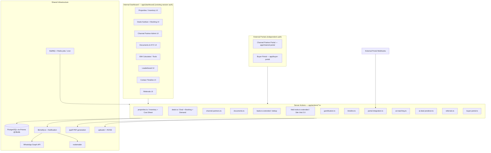
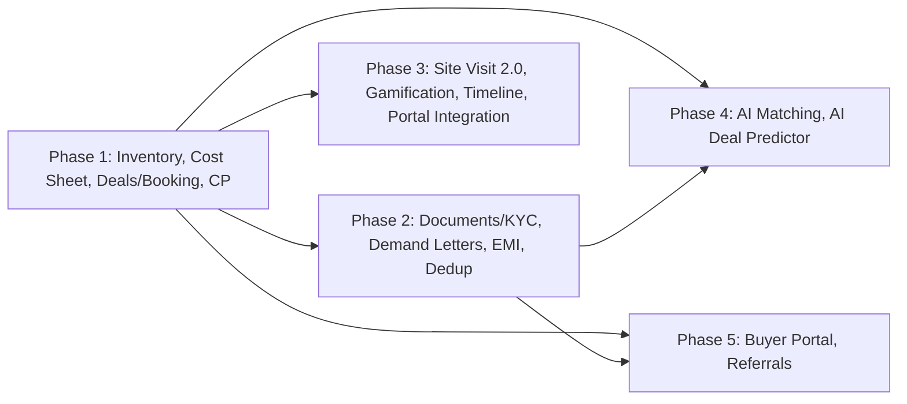
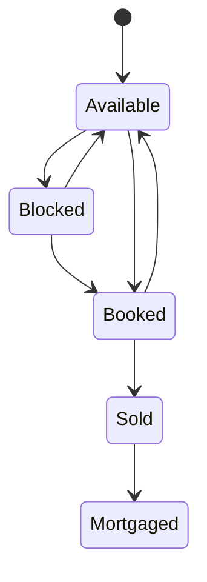

# Design Document

## Overview

This design adds **16 new modules** to **Realzentic**, an existing Next.js 16 (App Router) + Prisma 6 / PostgreSQL real estate CRM, turning it into a complete property-sales platform. The work is delivered across **5 phases** and is layered on top of the existing application without breaking it: new Prisma models are *added* to the single `prisma/schema.prisma` file and reuse the existing `Contact`, `Lead`, `Staff`, `FieldVisit`, `DailyPayment`, `Appointment`, `Walkin`, and `Notification` models rather than duplicating them.

The design follows the conventions already established in the codebase:

- **Server Actions** (`'use server'`) live in `app/actions/*.ts` and return a uniform `{ success: boolean, error?: string, data?: T }` result shape (see `app/actions/leads.ts`, `app/actions/auth.ts`).
- **Validation** uses **Zod** schemas in `lib/validations/*` and is applied *before* any database write.
- **Data access** goes through the shared Prisma client at `@/lib/db`.
- **Internal dashboard auth** uses the existing HMAC-signed cookie session (`lib/session.ts`, `lib/auth-helpers.ts`) and is left unchanged.
- **Notifications** reuse `lib/notify.ts` + the `Notification` model.
- **Documents/PDF** reuse `jspdf` (already a dependency) and the `uploads/` storage path + `app/api/upload` route; R2/S3 (`lib/r2.ts`) is available for remote storage.
- **Drag-and-drop** Kanban reuses `@dnd-kit` (already a dependency); **charts** reuse `recharts`.
- **Background/scheduled work** (timed-hold expiry, demand-letter generation, AI score recalculation, milestone overdue sweeps) reuses `bullmq` + `ioredis` (already dependencies) and the existing `app/api/cron` pattern.

The platform's top priority is **correctness**: a schema that compiles and syncs (`npx prisma db push`), a build that passes with zero errors (`npm run build`), zero UI/backend/database logic errors, and end-to-end flows that work. The design therefore emphasizes single-transaction multi-record writes, controlled state-machine transitions, deterministic financial computation, and validation-before-write across every new service.

### Design Goals

1. **Additive, non-duplicating schema** — extend `FieldVisit` and reuse `Contact`/`DailyPayment`/`Notification`; never re-model an existing entity.
2. **Deterministic money math** — every monetary computation (total price, net payable, GST, stamp duty, commission, EMI, milestone split) is a pure function with bounded inputs and rounding rules, making it directly property-testable.
3. **Inventory safety** — a single unit can never be double-booked; status changes obey an explicit transition table enforced inside DB transactions with row-level locking.
4. **Isolation of new portals** — the Channel Partner Portal and Buyer Portal authenticate independently from the internal dashboard and strictly scope every query to the authenticated principal.
5. **Phase isolation** — each phase ships independently; later phases (AI, portals) depend on earlier-phase models but earlier phases do not depend on later ones.

## Architecture

### System Context



### Phase Dependency Graph



Phase 1 establishes the core entities (`Project`/`Tower`/`Floor`/`Unit`, `Deal`, `Booking`, `ChannelPartner`) that every later phase references. Phases 2–5 are independent of one another and may be delivered in any order after Phase 1, though the default order is 1→5 (assumption A8).

### Key Architectural Decisions

| Decision | Choice | Rationale |
|---|---|---|
| Schema location | Single `prisma/schema.prisma`, additive models | Req 20.1 — reuse, never duplicate; one schema keeps relations and `db push` coherent |
| Concurrency / double-booking | `prisma.$transaction` with `SELECT ... FOR UPDATE` row locks on the `Unit` row | Req 2.4, 5.4, 20.5 — only the first concurrent block/booking wins |
| Status changes | Explicit transition table validated in code inside the transaction | Req 2.1, 2.2 — deterministic, testable state machine |
| Portal auth | Separate JWT/HMAC cookie scoped to portal, independent of dashboard session | Req 7, 18, 21 — isolation; dashboard auth unchanged |
| Scheduled work | BullMQ jobs triggered by `app/api/cron/*` routes | Reuses existing infra for hold expiry, demand letters, AI recalc, overdue sweeps |
| Money representation | Integer paise or `Decimal`-validated `Float` bounded `0.00–999,999,999.99`, rounded to 2 dp | Deterministic, avoids float drift in totals |
| PDF | `jspdf` server-side, branding from `StoreSettings` | A9; library already present |
| Duplicate detection | Normalized phone exact, lowercased email exact, Levenshtein(name) < 3 | Req 11.1; pure function, property-testable |

### Money & Rounding Convention

All monetary values are validated to the range `0.00 … 999,999,999.99`. Derived monetary outputs are rounded to **2 decimal places** using round-half-up. Commission and EMI computations round their final result to 2 dp. This is centralized in a `lib/money.ts` helper (`roundMoney(n)`, `assertMoneyRange(n)`) so every service shares identical semantics.

## Components and Interfaces

Each service is a set of server actions returning `{ success, error?, data? }`. Signatures below are representative; full Zod schemas live in `lib/validations/`.

### Module 1 — Inventory_Service (`app/actions/properties.ts`)

Manages `Project`, `Tower`, `Floor`, `Unit`, `UnitPriceHistory`, and analytics.

```ts
createProject(data): Result<Project>          // validates required fields + enums (Req 1.1, 1.10)
createTower(data): Result<Tower>              // Req 1.2
createFloor(data): Result<Floor>              // Req 1.3
createUnit(data): Result<Unit>               // Req 1.4, computes totalPrice (Req 1.5)
bulkCreateUnits(towerId, floorRange, spec): Result<{count}>  // single tx, all-or-nothing (Req 1.9)
listProjects(): Result<ProjectCard[]>         // includes percentSold (Req 1.6)
getProjectDetail(projectId): Result<...>      // towers + floor grid (Req 1.7)
filterUnits(projectId, filters): Result<Unit[]>  // type/status/price/area/facing/floor (Req 1.8)
changeUnitStatus(unitId, toStatus, actor): Result<Unit>  // transition table + tx lock (Req 2.1–2.4)
blockUnit(unitId, holdHours, actor): Result<Unit>        // Timed_Hold (Req 2.5)
revisePrice(unitId, newPrice, reason, actor): Result<Unit>  // UnitPriceHistory (Req 2.7)
getInventoryAnalytics(projectId): Result<Analytics>      // Req 2.8
```

**Pure helpers (property-tested):**
- `computeTotalPrice(basePsf, superBuiltUpArea, floorRisePremium, viewPremium): number` — Req 1.5
- `computePercentSold(booked, sold, total): number` — Req 1.6 (0 when total 0, rounded to nearest int)
- `canTransition(from, to): boolean` — Req 2.1/2.2 transition table
- `computeAnalytics(units): { percentSold, revenuePotential, availableStockValue }` — Req 2.8

**Transition table** (`canTransition`):


All transitions not on this diagram are rejected (Req 2.2).

### Module 2 — Cost_Sheet_Service (`app/actions/properties.ts`)

```ts
buildCostSheet(unitId, contactId, addons, discount, actor): Result<CostSheet>  // Req 3.1–3.4
computeStampDuty(state, baseAmount): number            // A6 / Maharashtra default (Req 3.5)
gstRateForProject(projectStatus): number               // 5% / 0% / 5% default (Req 3.6–3.8)
generateCostSheetPdf(costSheetId): Result<{pdfUrl}>     // branded; preserves old URL on fail (Req 3.9)
shareCostSheet(costSheetId, channel): Result<{deliveryStatus}>  // WhatsApp/Email (Req 3.10)
upsertPaymentPlan(projectId, plan): Result<PaymentPlan> // ≤1 default per project (Req 3.11)
```

**Pure helpers:**
- `computeNetPayable(total, addons, discount): number` — Req 3.3 (`total + Σaddons − discount`)
- `validateDiscount(gross, discount): boolean` — Req 3.4 (reject discount > gross)
- `gstRateForProject(status)` — Req 3.6–3.8 (total function over status)
- `splitMilestones(plan, netPayable): Milestone[]` — sum equals netPayable (Req 3.11)

### Module 3 — Deal_Service & Booking_Engine (`app/actions/deals.ts`)

```ts
// Deal pipeline
createDealStage(data), reorderStages(...)             // Req 4.1
createDeal(data): Result<Deal>                        // Req 4.2
moveDeal(dealId, toStageId, actor, lostReason?): Result<Deal>  // logs DealActivity; lost-reason rule (Req 4.3,4.4,4.9)
getDealDetail(dealId): Result<...>                    // timeline/docs/milestones/cost sheet (Req 4.7)
getDealAnalytics(): Result<StageAgg[]>                // count + Σvalue by stage (Req 4.8)

// Booking engine
convertDealToBooking(dealId, bookingData, actor): Result<Booking>  // single tx; unit→Booked (Req 5.1–5.5)
recordTokenPayment(bookingId, payment): Result<...>   // via DailyPayment (Req 5.6, A5)
cancelBooking(bookingId, reason, actor): Result<...>  // unit→Available in tx (Req 5.7)
```

**Pure helpers:**
- `validateStageMove(deal, targetStage): {ok, error?}` — Req 4.4, 4.9
- `milestonesFromPlan(plan, agreementValue): BookingMilestone[]` — Σ == agreementValue (Req 5.5)
- `milestoneStatus(milestone, now): Status` — Overdue / Partially_Paid / Paid (Req 5.8, 9.7)

The Kanban board uses `@dnd-kit`; on drop it optimistically moves the card, calls `moveDeal`, and on failure reverts the card and shows an error (Req 4.5, 4.6).

### Module 4 — Channel_Partner_Service (`app/actions/channel-partners.ts`) & Channel_Portal (`app/channel-portal/`)

```ts
// Admin (internal)
onboardPartner(data): Result<ChannelPartner>          // RERA required + unique (Req 6.1, 6.9)
createCpLead(partnerId, leadData): Result<CPLead>     // Req 6.2
computeCommission(partner, booking): number           // %/Fixed/Slab (Req 6.4,6.5,6.8)
createCommission(...), approveCommission(...)          // Req 6.3
createPayoutBatch(commissionIds): Result<CPPayoutBatch>     // Req 6.6
completePayoutBatch(batchId): Result<...>             // sets included commissions → Paid (Req 6.6)
getPartnerMetrics(): Result<Metrics>                  // Req 6.7

// Portal (separate auth)
cpLogin(email, password): Result<{token}>             // Active only; rate-limited (Req 7.1,7.2)
cpBrowseInventory(): Result<Unit[]>                   // live Available units (Req 7.5)
cpSubmitLead(data): Result<CPLead>                    // Req 7.6
cpCommissionStatements(): Result<...>                 // own data only (Req 7.3,7.4,7.7)
```

**Pure helper:** `computeCommission(type, rate, fixedAmount, slabs, agreementValue): number` — rounded 2 dp (Req 6.4, 6.5, 6.8).

The Channel Portal uses an independent signed cookie (`cp_session`) and a middleware-style guard that redirects unauthenticated requests to `/channel-portal/login` (Req 7.8, 21.1) and scopes every query by `partnerId` from the session (Req 7.3, 7.4, 21.2). Login attempts are rate-limited via `lib/rate-limit.ts` (5 failures / 15 min → 15 min block, Req 7.2).

### Module 5 — Document_Service (`app/actions/documents.ts`)

```ts
uploadDocument(entityType, entityId, type, file): Result<Document>  // size 1B–25MB, type allow-list (Req 8.1–8.3)
createKycRecord(contactId, data): Result<KYCRecord>   // Req 8.4
upsertDocumentTemplate(data): Result<DocumentTemplate>  // merge-field body (Req 8.5)
generateFromTemplate(templateId, mergeValues): Result<{pdfUrl}>  // reject unresolved field (Req 8.6)
listExpiringDocuments(windowDays): Result<Document[]> // default 30, 1–365 (Req 8.7)
```

**Pure helpers:** `validateUpload(sizeBytes, mimeType): {ok, reason?}` (Req 8.2, 8.3); `resolveMergeFields(templateBody, values): {ok, missing?: string[]}` (Req 8.6).

### Module 6 — Demand Letter & Payment Automation (in `app/actions/deals.ts`)

```ts
generateDemandLetters(windowDays): Result<{generated}>  // dedup per milestone+window (Req 9.1)
sendDemandLetter(letterId): Result<...>                // WA + Email, retry ≤3 (Req 9.2,9.3)
sweepOverdueMilestones(): Result<...>                  // set Overdue + notify (Req 9.4)
recordMilestonePayment(milestoneId, amount): Result<...>  // partial/paid; reject bad amount (Req 9.7,9.8)
getOverdueCollections(): Result<{count, sumUnpaid}>    // dashboard widget (Req 9.6)
```

**Pure helpers:** `applyMilestonePayment(milestone, amount): {ok, milestone?, error?}` (Req 9.7, 9.8); `shouldGenerateDemand(milestone, now, windowDays, existingLetters): boolean` (Req 9.1).

Background jobs (BullMQ, triggered by `app/api/cron/demand-letters` and `app/api/cron/overdue-sweep`) call `generateDemandLetters` and `sweepOverdueMilestones`.

### Module 7 — EMI_Calculator (`app/(dashboard)/tools/emi-calculator/page.js`)

Client-side tool. Pure compute functions in `lib/emi.ts`:
- `computeEmi(principal, annualRatePct, tenureMonths): number` — standard EMI formula (Req 10.1)
- `amortizationSchedule(principal, annualRatePct, tenureMonths): Row[]` (Req 10.1)
- `validateDownPayment(propertyValue, downPayment): boolean` — reject `downPayment >= propertyValue` (Req 10.6)

Bank-rate comparison (SBI/HDFC/ICICI/Axis/Kotak/PNB) is rendered from a config constant (Req 10.2). Saving to a deal stores JSON in `Deal.metadata` without a new model (Req 10.4). Stamp-duty estimate reuses `computeStampDuty` (Req 10.3).

### Module 8 — Duplicate Lead Detection (`app/actions/leads.ts` extended)

```ts
findDuplicates(candidate): Result<Match[]>            // phone/email/name<3 (Req 11.1)
mergeContacts(targetId, sourceId, fieldChoices): Result<Contact>  // tx; reassign relations (Req 11.3,11.4)
dedupReport(): Result<Group[]>                        // groups of ≥2 (Req 11.6)
```

**Pure helpers:** `levenshtein(a, b): number`; `normalizePhone(p): string`; `duplicateConfidence(candidate, existing): number` (0–100, Req 11.2); `isDuplicate(candidate, existing): boolean` (Req 11.1). `createLead` is extended so that an existing phone links a new `Lead` to the existing `Contact` (Req 11.7) — building on the find-or-create already present in `leads.ts`.

### Module 9 — Field_Visit_Service / Site Visit 2.0 (`app/actions/field-visits.ts` extended)

Extends the existing `FieldVisit` model (no new visit model, Req 12.1). New helpers:
- `haversineMeters(lat1,lng1,lat2,lng2): number` — geo distance (Req 12.4)
- `withinGeofence(agentLat, agentLng, projLat, projLng, radiusM=500): boolean` (Req 12.4)
- OTP generate/verify (Req 12.2, 12.3); analytics (Req 12.6).

### Module 10 — Gamification_Service (`app/actions/gamification.ts`)

Models `AgentScore`, `Badge`, `AgentBadge`. `awardBadges(staffId, period)` awards each earned badge **exactly once per period** (unique constraint on `(staffId, badgeId, period)`, Req 13.4). Leaderboard ranking is a pure sort over the selected metric (Req 13.3); visibility gated by an admin setting (A10, Req 13.5).

### Module 11 — Timeline_Service (`app/actions/timeline.ts`)

`getContactTimeline(contactId, cursor, type?)` aggregates calls, WhatsApp/email, site visits, payments, documents, deal-stage changes, and notes into a unified entry list, **sorted reverse-chronologically** (Req 14.2) and paginated for infinite scroll (Req 14.5). Pure helper `mergeTimeline(sources): Entry[]` (Req 14.1, 14.2).

### Module 12 — Portal_Integration_Service (`app/actions/portal-integration.ts`)

Models `PortalConfig`, `PortalLead`. Webhook handler at `app/api/webhooks/portals/[portal]` validates payload, ignores disabled portals (Req 15.4), deduplicates against contacts, creates `Contact`+`Lead`, auto-assigns per config, and notifies the assignee (Req 15.3). Pure helper `validatePortalPayload(payload): {ok, error?}` (Req 15.6); source attribution recorded on the lead (Req 15.5, A7).

### Module 13 — AI_Matching_Service (`app/actions/ai-matching.ts`)

`matchUnits(preferences)` returns a ranked list of **Available-only** units (Req 16.2) with a `matchPercentage`. Pure scorer `scoreMatch(preferences, unit): number` (0–100, Req 16.1). On new inventory, `notifyMatchingAgents(unit)` alerts agents of matching buyers (Req 16.3).

### Module 14 — AI_Deal_Predictor (`app/actions/ai-deal-predictor.ts`)

```ts
computeDealScore(deal, signals): number               // weighted, clamped 0–100 (Req 17.1,17.2)
scoreAndPersistDeal(dealId): Result<...>              // stores score + timestamp; hot/at-risk (Req 17.3–17.6)
recalcAllDeals(): Result<{updated, failed}>            // daily; retain last on failure (Req 17.7,17.8)
```

**Pure scorer** `computeDealScore`: weighted factors (site visits ×15, response time ×10, KYC ×20, budget ratio ×10, days-since-engagement ×15 with decay, source quality ×10, cost-sheet viewed ×10, token paid ×10), clamped to `[0,100]`; if a token payment exists, the score is forced to `[90,100]` (Req 17.2). Hot deal when score > 80 (Req 17.4); At Risk when score < 30 and no activity for 7 days (Req 17.6). Daily recalculation runs via BullMQ/cron and retains the last good score on per-deal failure (Req 17.8).

### Module 15 — Buyer_Portal (`app/buyer-portal/`, `app/actions/buyer-portal.ts`)

Models `BuyerSession`, `ConstructionUpdate`, `SupportTicket`, `PossessionChecklist`. OTP login (6-digit, WhatsApp→SMS fallback, 300s expiry, Req 18.2) with 5-attempt/15-min lockout (Req 18.4); 24-hour session token (Req 18.5, 18.7). Every query scoped to the session's `contactId` (Req 18.6, 21.2). Pure helpers: `otpExpired(generatedAt, now, ttl=300): boolean` (Req 18.2, 21.3); `sessionExpired(createdAt, now, ttl=86400): boolean` (Req 18.7).

### Module 16 — Referral_Service (`app/actions/referrals.ts`)

Models `ReferralProgram`, `Referral`. `createReferral` rejects self-referral (referrer == referred, Req 19.7). When a referred contact's deal reaches a won stage, `markReferralEligible` computes the reward from the program (Req 19.3). Pure helpers: `isSelfReferral(referrerId, referredId): boolean` (Req 19.7); `computeReward(program): number` (Req 19.3).

## Data Models

All models below are **added** to `prisma/schema.prisma`. Existing models are extended only where noted (`FieldVisit`). Monetary fields use `Decimal @db.Decimal(12,2)` (range `0.00–999,999,999.99`); enums are Prisma enums for determinism.

### Enums

```prisma
enum ProjectType { Residential Commercial Mixed }
enum ProjectStatus { Upcoming UnderConstruction ReadyToMove }
enum UnitType { BHK1 BHK2 BHK3 BHK4 Shop Office Plot }
enum UnitFacing { N S E W NE NW SE SW }
enum UnitStatus { Available Blocked Booked Sold Mortgaged }
enum CommissionType { Percentage Fixed Slab }
enum PartnerType { Individual Firm Company }
enum PartnerStatus { Active Inactive Suspended }
enum CommissionStatus { Pending Approved Paid Disputed }
enum PayoutBatchStatus { Draft Processing Completed }
enum MilestoneStatus { Upcoming Due Overdue Paid Partially_Paid }
enum BookingStatus { Active Cancelled Completed }
enum DocumentStatus { Pending Verified Rejected Expired }
enum SupportTicketStatus { Open InProgress Resolved Closed }
```

### Phase 1 Models

```prisma
model Project {
  id            Int            @id @default(autoincrement())
  name          String
  location      String
  city          String
  state         String
  reraNumber    String?
  reraExpiry    DateTime?
  type          ProjectType
  status        ProjectStatus
  builderName   String?
  totalUnits    Int            @default(0)
  description   String?
  amenities     String[]
  brochureUrl   String?
  photoUrls     String[]
  latitude      Float?
  longitude     Float?
  possessionDate DateTime?
  createdAt     DateTime       @default(now())
  updatedAt     DateTime       @updatedAt
  towers        Tower[]
  paymentPlans  PaymentPlan[]
  @@index([city])
  @@index([status])
}

model Tower {
  id          Int     @id @default(autoincrement())
  projectId   Int
  project     Project @relation(fields: [projectId], references: [id], onDelete: Cascade)
  name        String
  totalFloors Int
  status      String  @default("Active")
  floors      Floor[]
  units       Unit[]
  @@index([projectId])
}

model Floor {
  id            Int    @id @default(autoincrement())
  towerId       Int
  tower         Tower  @relation(fields: [towerId], references: [id], onDelete: Cascade)
  floorNumber   Int
  floorPlanUrl  String?
  @@unique([towerId, floorNumber])
}

model Unit {
  id                 Int        @id @default(autoincrement())
  towerId            Int
  tower              Tower      @relation(fields: [towerId], references: [id], onDelete: Cascade)
  floorNumber        Int
  unitNumber         String
  type               UnitType
  carpetArea         Float
  superBuiltUpArea   Float
  facing             UnitFacing
  status             UnitStatus @default(Available)
  basePricePerSqft   Decimal    @db.Decimal(12, 2)
  floorRisePremium   Decimal    @default(0) @db.Decimal(12, 2)
  viewPremium        Decimal    @default(0) @db.Decimal(12, 2)
  totalPrice         Decimal    @db.Decimal(12, 2)
  parkingType        String?
  parkingCount       Int        @default(0)
  // Timed hold
  holdByStaffId      Int?
  holdByPartnerId    Int?
  holdCreatedAt      DateTime?
  holdExpiresAt      DateTime?
  // Booking reference
  bookingId          Int?
  createdAt          DateTime   @default(now())
  updatedAt          DateTime   @updatedAt
  priceHistory       UnitPriceHistory[]
  costSheets         CostSheet[]
  deals              Deal[]
  @@unique([towerId, unitNumber])
  @@index([status])
  @@index([type])
}

model UnitPriceHistory {
  id          Int      @id @default(autoincrement())
  unitId      Int
  unit        Unit     @relation(fields: [unitId], references: [id], onDelete: Cascade)
  oldPrice    Decimal  @db.Decimal(12, 2)
  newPrice    Decimal  @db.Decimal(12, 2)
  changedById Int?
  effectiveDate DateTime @default(now())
  reason      String
  @@index([unitId])
}

model CostSheet {
  id            Int      @id @default(autoincrement())
  unitId        Int
  unit          Unit     @relation(fields: [unitId], references: [id])
  contactId     Int
  contact       Contact  @relation(fields: [contactId], references: [id])
  baseCost      Decimal  @db.Decimal(12, 2)
  floorRise     Decimal  @default(0) @db.Decimal(12, 2)
  viewPremium   Decimal  @default(0) @db.Decimal(12, 2)
  parkingCharges Decimal @default(0) @db.Decimal(12, 2)
  clubhouseCharges Decimal @default(0) @db.Decimal(12, 2)
  legalCharges  Decimal  @default(0) @db.Decimal(12, 2)
  stampDuty     Decimal  @default(0) @db.Decimal(12, 2)
  gst           Decimal  @default(0) @db.Decimal(12, 2)
  registrationCharges Decimal @default(0) @db.Decimal(12, 2)
  total         Decimal  @db.Decimal(12, 2)
  discount      Decimal  @default(0) @db.Decimal(12, 2)
  netPayable    Decimal  @db.Decimal(12, 2)
  generatedById Int?
  generatedAt   DateTime @default(now())
  pdfUrl        String?
  @@index([unitId])
  @@index([contactId])
}

model PaymentPlan {
  id         Int      @id @default(autoincrement())
  projectId  Int
  project    Project  @relation(fields: [projectId], references: [id], onDelete: Cascade)
  name       String
  isDefault  Boolean  @default(false)
  milestones Json     // [{ name, dueOffsetDays, percentage }]
  schedules  PaymentSchedule[]
  @@index([projectId])
}

model PaymentSchedule {
  id            Int         @id @default(autoincrement())
  bookingId     Int
  booking       Booking     @relation(fields: [bookingId], references: [id], onDelete: Cascade)
  paymentPlanId Int
  paymentPlan   PaymentPlan @relation(fields: [paymentPlanId], references: [id])
  @@index([bookingId])
}

model DealStage {
  id          Int      @id @default(autoincrement())
  name        String
  order       Int
  color       String   @default("#888888")
  isWon       Boolean  @default(false)
  isLost      Boolean  @default(false)
  autoActions Json?
  deals       Deal[]
  @@index([order])
}

model Deal {
  id              Int        @id @default(autoincrement())
  contactId       Int
  contact         Contact    @relation(fields: [contactId], references: [id])
  unitId          Int?
  unit            Unit?      @relation(fields: [unitId], references: [id])
  assignedAgentId Int?
  assignedAgent   Staff?     @relation(fields: [assignedAgentId], references: [id])
  channelPartnerId Int?
  channelPartner  ChannelPartner? @relation(fields: [channelPartnerId], references: [id])
  stageId         Int
  stage           DealStage  @relation(fields: [stageId], references: [id])
  value           Decimal    @db.Decimal(12, 2)
  expectedCloseDate DateTime?
  source          String?
  notes           String?
  aiScore         Int?       // 0..100
  aiScoredAt      DateTime?
  isHot           Boolean    @default(false)
  isAtRisk        Boolean    @default(false)
  lostReason      String?
  wonDate         DateTime?
  metadata        Json?      // EMI saved calculations (Req 10.4)
  createdAt       DateTime   @default(now())
  updatedAt       DateTime   @updatedAt
  activities      DealActivity[]
  booking         Booking?
  commissions     CPCommission[]
  referrals       Referral[]
  @@index([stageId])
  @@index([contactId])
  @@index([aiScore])
}

model DealActivity {
  id          Int      @id @default(autoincrement())
  dealId      Int
  deal        Deal     @relation(fields: [dealId], references: [id], onDelete: Cascade)
  type        String
  description String
  oldStageId  Int?
  newStageId  Int?
  performedById Int?
  createdAt   DateTime @default(now())
  @@index([dealId])
}

model Booking {
  id              Int      @id @default(autoincrement())
  dealId          Int      @unique
  deal            Deal     @relation(fields: [dealId], references: [id])
  unitId          Int
  unit            Unit     @relation("BookingUnit", fields: [unitId], references: [id])
  contactId       Int
  contact         Contact  @relation(fields: [contactId], references: [id])
  bookingDate     DateTime @default(now())
  agreementValue  Decimal  @db.Decimal(12, 2)
  tokenAmount     Decimal  @db.Decimal(12, 2)
  tokenReceiptNo  String
  tokenDate       DateTime?
  tokenMode       String?
  paymentPlanId   Int?
  status          BookingStatus @default(Active)
  cancellationReason String?
  cancellationDate   DateTime?
  milestones      BookingMilestone[]
  schedules       PaymentSchedule[]
  commissions     CPCommission[]
  @@index([unitId])
  @@index([contactId])
}

model BookingMilestone {
  id          Int      @id @default(autoincrement())
  bookingId   Int
  booking     Booking  @relation(fields: [bookingId], references: [id], onDelete: Cascade)
  name        String
  dueDate     DateTime
  amount      Decimal  @db.Decimal(12, 2)
  paidAmount  Decimal  @default(0) @db.Decimal(12, 2)
  status      MilestoneStatus @default(Upcoming)
  demandLetters DemandLetter[]
  @@index([bookingId])
  @@index([status])
}

model DemandLetter {
  id            Int      @id @default(autoincrement())
  milestoneId   Int
  milestone     BookingMilestone @relation(fields: [milestoneId], references: [id], onDelete: Cascade)
  windowDays    Int
  generatedAt   DateTime @default(now())
  whatsappStatus String  @default("Pending")
  emailStatus    String  @default("Pending")
  sentDate       DateTime?
  pdfUrl         String?
  @@index([milestoneId])
}

model ChannelPartner {
  id            Int      @id @default(autoincrement())
  name          String
  company       String?
  reraBrokerNo  String   @unique
  phone         String
  email         String   @unique
  passwordHash  String?
  type          PartnerType
  status        PartnerStatus @default(Active)
  commissionRate Decimal @default(0) @db.Decimal(6, 2)
  commissionType CommissionType @default(Percentage)
  fixedCommission Decimal @default(0) @db.Decimal(12, 2)
  commissionSlabs Json?   // [{ minValue, maxValue, rate }]
  agreementDocUrl String?
  onboardingDate DateTime @default(now())
  panNumber     String?
  bankDetails   Json?
  cpLeads       CPLead[]
  commissions   CPCommission[]
  deals         Deal[]
  @@index([status])
}

model CPLead {
  id          Int      @id @default(autoincrement())
  partnerId   Int
  partner     ChannelPartner @relation(fields: [partnerId], references: [id], onDelete: Cascade)
  leadId      Int?
  lead        Lead?    @relation(fields: [leadId], references: [id])
  submittedDate DateTime @default(now())
  status      String   @default("Submitted")
  commissionEligible Boolean @default(false)
  attributionVerified Boolean @default(false)
  @@index([partnerId])
}

model CPCommission {
  id          Int      @id @default(autoincrement())
  partnerId   Int
  partner     ChannelPartner @relation(fields: [partnerId], references: [id])
  dealId      Int?
  deal        Deal?    @relation(fields: [dealId], references: [id])
  bookingId   Int?
  booking     Booking? @relation(fields: [bookingId], references: [id])
  amount      Decimal  @db.Decimal(12, 2)
  percentage  Decimal  @default(0) @db.Decimal(6, 2)
  status      CommissionStatus @default(Pending)
  approvedById Int?
  paymentDate DateTime?
  utr         String?
  invoiceUrl  String?
  payoutBatchId Int?
  payoutBatch CPPayoutBatch? @relation(fields: [payoutBatchId], references: [id])
  @@index([partnerId])
  @@index([status])
}

model CPPayoutBatch {
  id          Int      @id @default(autoincrement())
  batchName   String
  totalAmount Decimal  @db.Decimal(12, 2)
  partnerCount Int     @default(0)
  date        DateTime @default(now())
  status      PayoutBatchStatus @default(Draft)
  commissions CPCommission[]
}
```

### Phase 2–5 Models

```prisma
model Document {
  id          Int      @id @default(autoincrement())
  entityType  String   // Contact | Deal | Project | Booking
  entityId    Int
  type        String
  fileUrl     String
  fileName    String
  fileSize    Int
  status      DocumentStatus @default(Pending)
  uploadedById Int?
  verifiedById Int?
  verifiedAt  DateTime?
  notes       String?
  expiryDate  DateTime?
  createdAt   DateTime @default(now())
  @@index([entityType, entityId])
  @@index([expiryDate])
}

model KYCRecord {
  id           Int      @id @default(autoincrement())
  contactId    Int
  contact      Contact  @relation(fields: [contactId], references: [id])
  documentType String
  documentNumber String
  frontImage   String?
  backImage    String?
  verified     Boolean  @default(false)
  verifiedById Int?
  verifiedAt   DateTime?
  autoVerified Boolean  @default(false)
  @@index([contactId])
}

model DocumentTemplate {
  id        Int     @id @default(autoincrement())
  name      String
  type      String
  category  String
  htmlBody  String
  header    String?
  footer    String?
  isDefault Boolean @default(false)
}

model AgentScore {
  id       Int    @id @default(autoincrement())
  staffId  Int
  staff    Staff  @relation(fields: [staffId], references: [id], onDelete: Cascade)
  period   String // YYYY-MM
  metrics  Json
  @@unique([staffId, period])
}

model Badge {
  id          Int    @id @default(autoincrement())
  name        String
  description String?
  icon        String?
  criteria    Json
  tier        String?
  agentBadges AgentBadge[]
}

model AgentBadge {
  id        Int      @id @default(autoincrement())
  staffId   Int
  staff     Staff    @relation(fields: [staffId], references: [id], onDelete: Cascade)
  badgeId   Int
  badge     Badge    @relation(fields: [badgeId], references: [id], onDelete: Cascade)
  earnedDate DateTime @default(now())
  period    String
  @@unique([staffId, badgeId, period])
}

model PortalConfig {
  id           Int      @id @default(autoincrement())
  portalName   String   @unique
  enabled      Boolean  @default(false)
  apiKey       String?
  webhookUrl   String?
  lastSyncAt   DateTime?
  autoAssignStaffId Int?
  portalLeads  PortalLead[]
}

model PortalLead {
  id            Int      @id @default(autoincrement())
  portalConfigId Int
  portalConfig  PortalConfig @relation(fields: [portalConfigId], references: [id], onDelete: Cascade)
  leadId        Int?
  lead          Lead?    @relation(fields: [leadId], references: [id])
  portalLeadId  String
  portalName    String
  inquiryDate   DateTime
  propertyName  String?
  buyerMessage  String?
  rawPayload    Json
  syncedAt      DateTime @default(now())
  deduplicated  Boolean  @default(false)
  @@index([portalConfigId])
}

model BuyerSession {
  id          Int      @id @default(autoincrement())
  contactId   Int
  contact     Contact  @relation(fields: [contactId], references: [id])
  phone       String
  otp         String
  otpExpiry   DateTime
  verified    Boolean  @default(false)
  sessionToken String? @unique
  createdAt   DateTime @default(now())
  @@index([phone])
}

model ConstructionUpdate {
  id          Int      @id @default(autoincrement())
  projectId   Int
  project     Project  @relation(fields: [projectId], references: [id], onDelete: Cascade)
  title       String
  description String?
  photos      String[]
  date        DateTime @default(now())
  milestonePct Int     @default(0)
  category    String?
}

model SupportTicket {
  id          Int      @id @default(autoincrement())
  contactId   Int
  contact     Contact  @relation(fields: [contactId], references: [id])
  bookingId   Int?
  subject     String
  description String
  category    String?
  status      SupportTicketStatus @default(Open)
  priority    String   @default("Normal")
  assignedToId Int?
  resolvedAt  DateTime?
  resolutionNotes String?
  createdAt   DateTime @default(now())
  @@index([contactId])
}

model PossessionChecklist {
  id          Int      @id @default(autoincrement())
  bookingId   Int      @unique
  items       Json
  inspectionDate DateTime?
  inspector   String?
  buyerSigned Boolean  @default(false)
  signatureUrl String?
  handoverDate DateTime?
  keysHanded  Boolean  @default(false)
}

model ReferralProgram {
  id         Int      @id @default(autoincrement())
  name       String
  rewardType String   // Cash | Discount | Gift
  rewardValue Decimal @db.Decimal(12, 2)
  active     Boolean  @default(true)
  terms      String?
  validFrom  DateTime?
  validUntil DateTime?
  referrals  Referral[]
}

model Referral {
  id            Int      @id @default(autoincrement())
  referrerId    Int
  referrer      Contact  @relation("ReferrerContact", fields: [referrerId], references: [id])
  referredId    Int
  referred      Contact  @relation("ReferredContact", fields: [referredId], references: [id])
  programId     Int
  program       ReferralProgram @relation(fields: [programId], references: [id])
  dealId        Int?
  deal          Deal?    @relation(fields: [dealId], references: [id])
  status        String   @default("Pending")
  rewardAmount  Decimal  @default(0) @db.Decimal(12, 2)
  rewardPaid    Boolean  @default(false)
  paidDate      DateTime?
  @@index([referrerId])
  @@index([referredId])
}
```

### Existing Model Extensions

`FieldVisit` is extended (Req 12.1) — no new visit model:

```prisma
// added to existing model FieldVisit
  projectId        Int?
  unitIds          Int[]
  geoCheckinLat    Float?
  geoCheckinLng    Float?
  geoCheckinTime   DateTime?
  otpCode          String?
  otpVerified      Boolean  @default(false)
  buyerRating      Int?     // 1..5
  feedbackLiked    String?
  feedbackDisliked String?
  feedbackConcerns String?
  followUpAction   String?
  visitDurationMin Int?
```

Back-relations are added to existing models where referenced: `Contact` gains `costSheets`, `bookings`, `deals`, `kycRecords`, `buyerSessions`, `supportTickets`, `referralsAsReferrer`, `referralsAsReferred`; `Staff` gains `agentScores`, `agentBadges`; `Lead` gains `cpLead`, `portalLead`. These are additive and do not change existing field semantics (Req 20.1).

## Correctness Properties

*A property is a characteristic or behavior that should hold true across all valid executions of a system — essentially, a formal statement about what the system should do. Properties serve as the bridge between human-readable specifications and machine-verifiable correctness guarantees.*

The following properties were derived from the acceptance-criteria prework. Pure-computation criteria (money math, status machines, matching, scoring, aggregation, validation) became properties; CRUD persistence, UI rendering, external sends, timing, and one-time setup checks became example/integration/smoke tests (see Testing Strategy). Redundant properties were consolidated during reflection.

### Inventory & Pricing

### Property 1: Unit total price composition

*For any* unit with base price-per-sqft, super-built-up area, floor-rise premium, and view premium within the valid money range, the computed total price equals `round(basePsf × superBuiltUpArea, 2) + floorRisePremium + viewPremium`.

**Validates: Requirements 1.5**

### Property 2: Percentage sold is bounded and well-defined

*For any* counts of booked, sold, and total units, `computePercentSold` returns an integer in `[0, 100]` equal to `round((booked + sold) / total × 100)` when total > 0, and exactly `0` when total = 0.

**Validates: Requirements 1.6**

### Property 3: Unit filtering soundness and completeness

*For any* set of units and any combination of filters (type, status, price, area, facing, floor), every unit in the result satisfies all active filters, and the result is empty if and only if no unit in the set satisfies all active filters.

**Validates: Requirements 1.8**

### Property 4: Bulk unit creation is all-or-nothing

*For any* batch of unit specifications, if at least one specification is invalid then zero units are created; if all specifications are valid then exactly `batch size` units are created.

**Validates: Requirements 1.9**

### Property 5: Record validation rejects invalid input by field

*For any* Project, Tower, Floor, or Unit input that omits a required field, supplies an out-of-range value, or supplies an invalid enum value, the write is rejected and the returned error identifies the offending field.

**Validates: Requirements 1.10, 20.4**

### Property 6: Unit status transition table

*For any* pair of statuses `(from, to)`, `canTransition(from, to)` is true if and only if the pair is one of the permitted transitions (Available→Blocked, Blocked→Available, Blocked→Booked, Available→Booked, Booked→Sold, Booked→Available, Sold→Mortgaged); a rejected transition leaves the unit status unchanged.

**Validates: Requirements 2.1, 2.2**

### Property 7: Block/book requires Available

*For any* unit whose status is not Available, a block or booking request is rejected with an error identifying the current status, and the unit status is unchanged.

**Validates: Requirements 2.3**

### Property 8: Timed hold expiry bounds

*For any* hold duration in `[1, 168]` hours, the recorded hold-expiry equals hold-creation time plus that duration and the blocking actor is recorded; a duration outside the range is rejected; an omitted duration defaults to 48 hours.

**Validates: Requirements 2.5**

### Property 9: Expired holds revert to Available

*For any* unit in Blocked status whose hold has expired and which has not progressed to Booked, the hold-expiry sweep returns the unit status to Available and clears the hold record.

**Validates: Requirements 2.6**

### Property 10: Price revision records history

*For any* valid price revision with a reason of length 1–500, a UnitPriceHistory record is created whose old price equals the prior price and whose new price equals the revised price, capturing changed-by and effective date.

**Validates: Requirements 2.7**

### Property 11: Inventory analytics aggregation

*For any* set of units in a project, analytics return percentage sold (per Property 2), total revenue potential equal to the sum of total price across all units, and available stock value equal to the sum of total price across Available units; available stock value never exceeds total revenue potential.

**Validates: Requirements 2.8**

### Cost Sheet & Payment Plans

### Property 12: Net payable composition

*For any* total, set of add-on charges, and discount within the valid money range, net payable equals `total + Σ(add-ons) − discount`.

**Validates: Requirements 3.3**

### Property 13: Discount never makes net payable negative

*For any* gross amount (total plus add-ons) and discount, if discount exceeds gross the cost sheet is rejected; otherwise the resulting net payable is greater than or equal to 0.

**Validates: Requirements 3.4**

### Property 14: Stamp duty uses state rate with Maharashtra default

*For any* project state and base amount, computed stamp duty equals `base × rate`, where `rate` is the configured rate for that state when present and the Maharashtra default rate otherwise.

**Validates: Requirements 3.5, 10.3**

### Property 15: GST rate is total over project status

*For any* project status, the GST rate is determinate and equals 5% when Under Construction, 0% when Ready to Move, and 5% for any other status.

**Validates: Requirements 3.6, 3.7, 3.8**

### Property 16: Milestone amounts sum to the basis amount

*For any* payment plan and basis amount (cost-sheet net payable for schedules, booking agreement value for bookings), the sum of generated milestone amounts equals the basis amount exactly.

**Validates: Requirements 3.11, 5.5**

### Deal Pipeline & Booking

### Property 17: Valid stage move logs an activity

*For any* deal and any existing target stage, moving the deal creates a DealActivity recording the old stage, new stage, timestamp, and performer.

**Validates: Requirements 4.3**

### Property 18: Invalid stage move is rejected

*For any* target stage that does not exist, the move is rejected, the deal retains its current stage, and an error indicates the target is invalid.

**Validates: Requirements 4.4**

### Property 19: Lost stage requires a lost reason

*For any* move to a stage whose is-lost flag is true with no lost reason provided, the save is rejected and the deal retains its current stage.

**Validates: Requirements 4.9**

### Property 20: Deal analytics aggregation

*For any* set of deals, deal analytics return, grouped by stage, a count equal to the number of deals in that stage and a value sum equal to the sum of those deals' values.

**Validates: Requirements 4.8**

### Property 21: Booking conversion requires Available or Blocked unit

*For any* deal-to-booking conversion, if the associated unit is Available or Blocked the conversion succeeds and the unit transitions to Booked; if the unit is in any other status the conversion is rejected and both the unit status and the deal are unchanged.

**Validates: Requirements 5.2, 5.3**

### Property 22: Booking cancellation restores the unit

*For any* active booking, cancellation sets the booking status to Cancelled with a recorded reason and date and returns the associated unit status to Available.

**Validates: Requirements 5.7**

### Property 23: Milestone status reflects payment and due date

*For any* milestone and payment, applying a payment of `p`: if `0 < p ≤ outstanding` then paid amount increases by `p` and status becomes Partially_Paid when resulting paid amount is less than the milestone amount, or Paid when it is greater than or equal to the milestone amount; and any unpaid milestone whose due date has passed has status Overdue.

**Validates: Requirements 5.8, 9.7**

### Property 24: Invalid milestone payments are rejected

*For any* payment amount that is zero, negative, or greater than the outstanding amount, the payment is rejected and the milestone is left unchanged.

**Validates: Requirements 9.8**

### Channel Partners

### Property 25: Percentage commission computation

*For any* Percentage partner with commission rate in `[0, 100]` and any booking agreement value, the commission equals `round(rate / 100 × agreementValue, 2)`.

**Validates: Requirements 6.4**

### Property 26: Slab commission selects the matching slab

*For any* slab configuration and agreement value, the commission equals `round(matchingSlabRate × agreementValue, 2)`, where the matching slab is the one whose value range contains the agreement value.

**Validates: Requirements 6.5**

### Property 27: Fixed commission is value-independent

*For any* Fixed partner and any two distinct agreement values, the computed commission is identical and equal to the partner's configured fixed amount.

**Validates: Requirements 6.8**

### Property 28: Completing a payout batch marks commissions paid

*For any* payout batch, after it transitions to Completed every commission included in the batch has status Paid.

**Validates: Requirements 6.6**

### Property 29: RERA broker number required and unique

*For any* channel-partner onboarding submission that omits the RERA broker number or supplies one already present on another partner, the submission is rejected with an error and no ChannelPartner record is created.

**Validates: Requirements 6.9**

### Property 30: Channel partner data isolation

*For any* authenticated channel partner, every query for leads, commissions, or statements returns only rows belonging to that partner, and any request targeting another partner's data is denied.

**Validates: Requirements 7.3, 7.4, 21.2**

### Property 31: Channel portal browses only Available units

*For any* inventory state, channel-portal inventory browsing returns only units whose status is Available.

**Validates: Requirements 7.5**

### Property 32: Channel partner lead submission validation

*For any* CP lead submission, if a required field (client name, phone, interested property, budget) is missing the submission is rejected with a validation error; if all required fields are present a CPLead is created attributed to the submitting partner.

**Validates: Requirements 7.6**

### Documents & KYC

### Property 33: Upload accepted within size and type bounds

*For any* file whose size is between 1 byte and 25 MB and whose type is on the accepted list, the upload is accepted and categorized by its selected type; for any file exceeding 25 MB or of a disallowed type, the upload is rejected with an error identifying the reason.

**Validates: Requirements 8.2, 8.3**

### Property 34: Template generation requires all merge fields

*For any* template and value map, document generation succeeds if and only if every merge field in the template body resolves to a value; otherwise generation is rejected with an error identifying an unresolved field.

**Validates: Requirements 8.6**

### Property 35: Document expiry alert window

*For any* document with an expiry date and any alert window in `[1, 365]` days, an expiry alert is shown if and only if the days until expiry is between 0 and the window inclusive.

**Validates: Requirements 8.7**

### Demand Letters

### Property 36: Demand letter generation and de-duplication

*For any* milestone and lead window (7, 15, or 30 days), a demand letter is generated if and only if the milestone is unpaid, its due date falls within the window, and no demand letter already exists for that milestone within the same window.

**Validates: Requirements 9.1**

### Property 37: Overdue collections aggregation

*For any* set of milestones, the overdue-collections widget count equals the number of milestones whose status is Overdue and the sum equals the total of their unpaid amounts (`amount − paidAmount`).

**Validates: Requirements 9.6**

### EMI Calculator

### Property 38: EMI computation and amortization consistency

*For any* principal, annual interest rate, and tenure in months, the computed monthly EMI matches the standard amortization formula, the amortization schedule's principal repayments sum to the principal, and the final outstanding balance is approximately zero.

**Validates: Requirements 10.1**

### Property 39: Down payment must be below property value

*For any* property value and down payment where down payment is greater than or equal to property value, a validation error is returned and no EMI is computed.

**Validates: Requirements 10.6**

### Duplicate Lead Detection

### Property 40: Duplicate detection criteria

*For any* candidate and existing contact, `isDuplicate` is true if and only if their normalized phone numbers are equal, OR their lowercased email addresses are equal, OR the Levenshtein distance between their full names is less than 3.

**Validates: Requirements 11.1**

### Property 41: Duplicate confidence is bounded

*For any* matched contact, the reported confidence score is an integer in `[0, 100]`.

**Validates: Requirements 11.2**

### Property 42: Merge preserves all linked records

*For any* source and target contacts, after a successful merge the surviving contact retains all leads, calls, payments, and appointments previously linked to either contact, and each merged field takes the user-selected per-field value.

**Validates: Requirements 11.3**

### Property 43: Dedup report groups are valid

*For any* set of contacts, every group in the deduplication report contains 2 or more contacts that mutually match the duplicate criteria, and the report is empty when no duplicate groups exist.

**Validates: Requirements 11.6**

### Property 44: Existing phone reuses contact

*For any* lead created with a phone number that already exists on a contact, the new lead is linked to that existing contact and no second contact is created, preserving the unique phone constraint.

**Validates: Requirements 11.7**

### Site Visit 2.0

### Property 45: OTP check-in verification

*For any* generated OTP and entered OTP, the site-visit check-in is accepted if and only if the entered OTP equals the generated OTP.

**Validates: Requirements 12.3**

### Property 46: Geofence check-in threshold

*For any* agent coordinates and project coordinates, the geo check-in is rejected if and only if the haversine distance between them exceeds 500 meters.

**Validates: Requirements 12.4**

### Property 47: Visit analytics aggregation

*For any* set of completed visits, visit analytics return the visit count, the average buyer rating over rated visits, and the average visit duration over timed visits, matching direct computation.

**Validates: Requirements 12.6**

### Gamification

### Property 48: Leaderboard ranking order

*For any* set of agent scores, the leaderboard for a selected metric is ordered in non-increasing order of that metric, so each rank's metric value is greater than or equal to the next.

**Validates: Requirements 13.3**

### Property 49: Badges awarded once per period

*For any* number of award invocations while an agent meets a badge's criteria in a period, exactly one AgentBadge exists for that `(staff, badge, period)` combination.

**Validates: Requirements 13.4**

### Unified Timeline

### Property 50: Timeline merge and ordering

*For any* set of source events (calls, messages, emails, site visits, payments, documents, deal-stage changes, notes) for a contact, the merged timeline contains exactly the union of those events and is sorted in non-increasing timestamp order.

**Validates: Requirements 14.1, 14.2**

### Property 51: Timeline type filter

*For any* timeline and selected entry type, every returned entry is of the selected type.

**Validates: Requirements 14.4**

### Property 52: Timeline pagination partitions entries

*For any* ordered timeline and page size, concatenating the successive pages reproduces the full ordered list with no duplicated or omitted entries.

**Validates: Requirements 14.5**

### Portal Integration

### Property 53: Disabled portals ignore webhooks

*For any* webhook delivered to a portal whose enabled flag is false, no Contact, Lead, or PortalLead record is created.

**Validates: Requirements 15.4**

### Property 54: Invalid webhook payloads create no records

*For any* webhook payload that fails validation, the payload is rejected with an error and no records are created.

**Validates: Requirements 15.6**

### AI Matching

### Property 55: Match scoring is bounded and ranked

*For any* buyer preferences and set of units, every produced match percentage is in `[0, 100]` and the result list is ordered in non-increasing order of match percentage.

**Validates: Requirements 16.1**

### Property 56: Matching considers only Available units

*For any* inventory, the matched-units result contains only units whose status is Available.

**Validates: Requirements 16.2**

### AI Deal Predictor

### Property 57: Deal score is bounded and clamped

*For any* combination of deal signals, `computeDealScore` returns an integer in `[0, 100]`; any intermediate result below 0 is set to 0 and any result above 100 is set to 100.

**Validates: Requirements 17.1**

### Property 58: Token payment forces a high score

*For any* deal with an existing token payment, the computed score is in `[90, 100]`, overriding the weighted-factor result.

**Validates: Requirements 17.2**

### Property 59: Hot deal threshold

*For any* deal score, the deal is marked Hot if and only if the score is greater than 80.

**Validates: Requirements 17.4**

### Property 60: At-risk classification

*For any* deal, it is marked At Risk if and only if its score is less than 30 and it has had no logged activity for 7 or more consecutive days.

**Validates: Requirements 17.6**

### Property 61: Failed recalculation retains last score

*For any* deal whose recomputation fails during a scheduled run, the persisted score remains equal to the last successfully computed score and an error indication is recorded for the run.

**Validates: Requirements 17.8**

### Buyer Portal

### Property 62: OTP expiry window

*For any* OTP generation time and current time, the OTP is expired if and only if the elapsed time exceeds 300 seconds, and a generated OTP consists of 6 digits.

**Validates: Requirements 18.2, 21.3**

### Property 63: OTP login rejection

*For any* OTP submission, login is rejected if the OTP is expired or does not match the generated OTP.

**Validates: Requirements 18.3**

### Property 64: Buyer data isolation

*For any* verified buyer session, every query for bookings, payments, or documents returns only rows belonging to that buyer's contact, and any request targeting another buyer's data is denied.

**Validates: Requirements 18.5, 18.6, 21.2**

### Property 65: Buyer session expiry

*For any* session creation time and current time, the session is expired if and only if the elapsed time exceeds 24 hours (86,400 seconds), and access via an expired token is denied pending re-authentication.

**Validates: Requirements 18.7**

### Property 66: Support ticket required-field validation

*For any* support-ticket creation input missing a required field, creation is rejected with an error; an input with all required fields present is persisted.

**Validates: Requirements 18.9**

### Referrals

### Property 67: Won referred deal computes reward

*For any* referral program, when a referred contact's deal reaches a won stage the referral is marked eligible and the reward amount equals the reward computed from the program's reward value.

**Validates: Requirements 19.3**

### Property 68: Self-referral is rejected

*For any* referral whose referrer and referred contact are the same, the referral is rejected with an error.

**Validates: Requirements 19.7**

### Cross-Cutting Integrity

### Property 69: Audit entry on status and financial actions

*For any* status-changing or financial action, an audit/activity record is created capturing who performed the action and when.

**Validates: Requirements 20.7**

## Error Handling

The design applies a consistent error strategy aligned with the existing `{ success, error }` action contract.

### Validation Errors (pre-write)

- Every server action validates input with a Zod schema (`lib/validations/*`) **before** any database access and returns `{ success: false, error }` naming the offending field (Req 1.10, 20.4). No partial writes occur on validation failure.
- Enum and range checks (money `0.00–999,999,999.99`, ratings 1–5, percentages 0–100, reason 1–500 chars) are encoded in the Zod schemas so invalid values never reach Prisma.

### Domain / State-Machine Errors

- Illegal unit-status transitions, bookings on non-Available units, and lost-stage moves without a reason return descriptive errors and leave state unchanged (Req 2.2, 2.3, 4.4, 4.9, 5.3). The current and requested states are included in the message.
- Discount-exceeds-gross and invalid milestone payments are rejected with the entity left untouched (Req 3.4, 9.8).

### Transaction & Concurrency Errors

- Multi-record operations (booking conversion + unit status + milestones; merge; bulk unit creation) run inside `prisma.$transaction`. Any failure rolls back the whole transaction so no partial state persists (Req 1.9, 5.1, 11.4, 20.6).
- Concurrent block/booking is serialized with `SELECT ... FOR UPDATE` row locks on the `Unit`; the losing request receives a "unit no longer available" error (Req 2.4, 5.4, 20.5).

### External Service Failures

- PDF generation failure preserves the existing `pdfUrl` and returns an error (Req 3.9); the document/cost-sheet record is not corrupted.
- WhatsApp/Email/SMS sends are fire-and-forget with per-channel status recorded; demand-letter sends retry up to 3 times, then record a failed status and notify the manager (Req 9.2, 9.3). Send failures never roll back the originating business write.
- Portal webhook validation failures and disabled-portal deliveries return errors / no-ops without creating records (Req 15.4, 15.6).
- A failed AI recalculation run retains each deal's last good score and records a run-level error indicator (Req 17.8).

### Authentication & Authorization Errors

- Unauthenticated portal requests redirect to the relevant login (Req 7.8, 21.1). Cross-principal access attempts return an authorization error (Req 7.4, 18.6, 21.2).
- Repeated login/OTP failures trigger time-boxed lockouts via `lib/rate-limit.ts` (Req 7.2, 18.4).

### Logging

- Failures in side-effect helpers (notify, email, WhatsApp) are logged via `console.error` following the existing `lib/notify.ts` pattern and do not throw into the caller's transaction.

## Testing Strategy

### Approach

The feature mixes pure business logic (highly suitable for property-based testing) with CRUD persistence, UI, external integrations, and infrastructure (suitable for example, integration, and smoke tests). The strategy uses both, matched to each criterion's classification from the prework.

### Property-Based Testing

- **Library:** `fast-check` with the existing test runner. PBT applies to the pure functions extracted into `lib/` (`computeTotalPrice`, `computePercentSold`, `computeNetPayable`, `gstRateForProject`, `computeStampDuty`, `splitMilestones`, `canTransition`, `computeCommission`, `computeEmi`, `levenshtein`/`isDuplicate`, `haversineMeters`, `computeDealScore`, `mergeTimeline`, `scoreMatch`, etc.) and to service logic exercised with a mocked/in-memory Prisma layer.
- **Iterations:** Each property test runs a **minimum of 100 iterations** (`fc.assert(..., { numRuns: 100 })`).
- **Tagging:** Each property test references its design property with a comment in the format:
  `// Feature: real-estate-crm, Property {number}: {property_text}`
- **Coverage:** One property-based test implements each of Properties 1–69. Generators are designed so edge cases flagged in prework (whitespace/Unicode names for Levenshtein, total-units 0 for percent sold, zero/negative/over-outstanding payments, out-of-range hold durations, boundary coordinates at exactly 500 m, scores at 0/30/80/100 boundaries) are exercised.
- **Money generators** produce values across the full `0.00–999,999,999.99` range plus boundary values to catch rounding/overflow.

### Unit (Example) Testing

Example-based unit tests cover criteria classified EXAMPLE: record persistence round-trips (Project/Tower/Floor/Unit, CostSheet, Deal, ChannelPartner, etc.), enum field mapping, deal-card drag revert behavior with a mocked failing action (Req 4.6), bank-rate table rendering (Req 10.2), source attribution mapping (Req 15.5), and config branches (Req 18.11). UI rendering criteria (floor grid color-coding, deal detail panels, timeline entry rendering, leaderboard/top-performer widgets) use component/snapshot tests rather than property tests.

### Integration Testing

Integration tests with 1–3 representative cases cover criteria classified INTEGRATION: concurrent block/booking serialization (Req 2.4, 5.4) using two simultaneous transactions against a test database; transactional rollback for merge and bulk create (Req 11.4, 20.6); PDF generation success/failure with the real `jspdf` path (Req 3.9, 7.7); WhatsApp/Email/SMS dispatch with mocked transports (Req 9.2, 12.2, 16.3); portal-webhook end-to-end ingestion (Req 15.3); and Hot-deal/At-risk notification timing (Req 17.5, 17.7).

### Smoke Testing

Single-execution smoke checks cover infrastructure and schema criteria: `npx prisma db push` applies cleanly with no errors (Req 20.2, 12.1 model extension, 20.1 no-duplication), `npm run build` completes with zero errors across all pages (Req 20.3), referential-integrity verification on seeded data (Req 20.8), and a regression check that existing `(dashboard)` routes remain governed by the unchanged session auth (Req 21.4).

### Build & Schema Gate

Because correctness is the top priority, CI runs, in order: `prisma generate` → `prisma db push` (against an ephemeral test DB) → `npm run build` → unit/property tests → integration tests. A failure at any stage blocks the change, directly enforcing Requirement 20.
